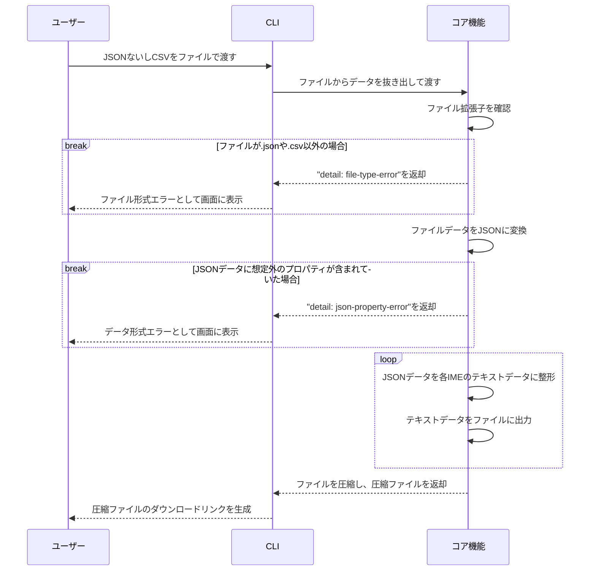

# DenoでIMEユーザー辞書を統一的に出力するツールを作った
tranoana.deno #16 (2024/05/15)

<!--
The last comment block of each slide will be treated as slide notes. It will be visible and editable in Presenter Mode along with the slide. [Read more in the docs](https://sli.dev/guide/syntax.html#notes)
-->

---
transition: fade-out
---

# 自己紹介

WhyKと言います。

## 普段
色んな会社でフロントエンドを書く仕事をしています。  
休日はGitHubでほんのり草を生やしています。

## 最近嬉しかったこと
『狼と香辛料』が再アニメ化したこと。

---
transition: fade-out
---

# アジェンダ

1. 作ろうと思った動機
2. IMEユーザー辞書出力の現況
3. 作成したもの
4. 出力の構造
5. 今後の展望

<!--
You can have `style` tag in markdown to override the style for the current page.
Learn more: https://sli.dev/guide/syntax#embedded-styles
-->

---
transition: fade-out
---

# 作ろうと思った動機

- 大量の設定を抱える同人サークルのWeb担当をしている
- 大量の用語をIMEユーザー辞書に手動で登録するのが手間
- サークルメンバーへの配布も考えると、主要なIMEのユーザー辞書は用意しないといけない
- 私自身がWindowsやAndroidなどで異なるIMEを使っている

## Denoを使った理由
- 開発環境が揃っている
- deno.land/xへの公開方法が楽
- 好きだから

---
transition: fade-out
---

# IMEユーザー辞書の現況
※会社によってはIMEと呼称していないところもありますが、ここではIMEと呼称します

## 辞書フォーマットは統一されていない
CSVやTSVというデータ形式、ジャンル名や品詞が設定できるか

## 特に品詞が統一されていない
- Google日本語入力は、サジェストのみに表示という設定変更も品詞に組み込んでいる
- 普通名詞だけでも、Googleは名詞でmacOS日本語入力システムは普通名詞
- 各IMEの品詞がどれくらい統一できるか表を作る必要があった

---
layout: two-cols
transition: fade-out
---

# 作ったもの
## bid（ビド）
build IME dictionaryの略

- 現状だとCLIのみ
- 自動化する場合はCI/CDツールでCLIを叩く手法になる
- CSV / JSONファイルでの入力に対応
- 統一された品詞
- 各IMEに適した辞書ファイルを出力
- リポジトリ内にExcelテンプレートもある

::right::

## 対応しているIME
- Google日本語入力
- Microsoft IME
- macOS日本語入力システム（iCloud経由でiOSなども含む）
- GBoard
- ATOK（Microsoft IMEのユーザー辞書取り込み）

---
layout: two-cols
transition: fade-out
---

# 出力の構造

::right::

- コア機能にはCLIに依存しない機能群が入っている

---
transition: fade-out
---

# 今後の展望
- プログラミング知識がない人でも扱える形態でのリリース（Webアプリなど）
- 他のIMEへの対応
- JSRへの公開
  - `deno.json(c)`と`jsr.json`の共存がまだ無理なので、`deno.land/x`と併用するために少し待ってる

## Issue / PR歓迎しています
独自用語が多い会社などの組織のほか、alias代わりにユーザー辞書を使うケースでも利用できると思います。  
不具合や気になる点があれば、IssueやPRをいただけると嬉しいです。

---
class: flex justify-center items-center
---

# ありがとうございました