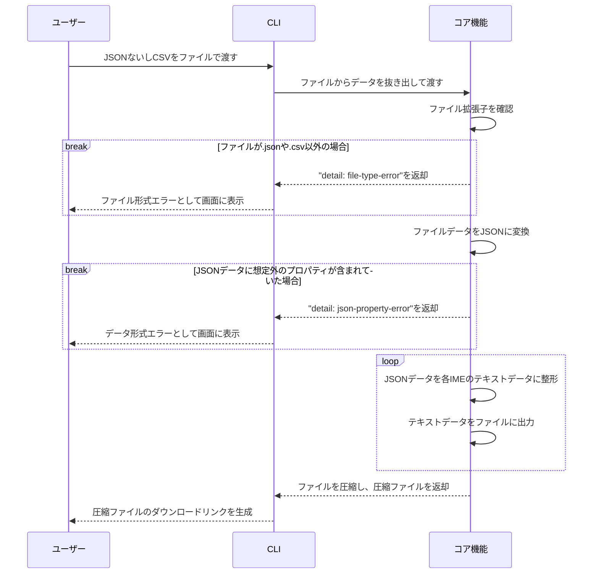

# DenoでIMEユーザー辞書を統一的に出力するツールを作った
toranoana.deno #16 (2024/05/15)

---
transition: fade-out
---

# 自己紹介

WhyKと言います。

## 普段
色んな会社でフロントエンドを書く仕事をしています。  
休日はコードを書いたりお茶を飲んでいます。

## 最近嬉しかったこと
『狼と香辛料』が再アニメ化したこと。

---
transition: fade-out
---

# はじめに
- Denoで作ったものの紹介なので、Denoらしい話はあんまり出てきません
- 以降のスライドで会社的にIMEと呼んでいないものも、ここではIMEとしてまとめて呼びます

---
transition: fade-out
---

# アジェンダ

1. 作ろうと思った動機
2. IMEユーザー辞書出力の現況
3. 作成したもの
4. 出力の構造
5. 今後の展望

---
transition: fade-out
---

# 作ろうと思った動機

- 個人的に所属している小規模グループが、大量の造語を抱えている
- 誤字しやすい造語もあるので、ユーザー辞書を配布したかった
- 誤字検知ツールも提供していたが、普及しなかった
- 自分以外でも編集できる形で、文字変換の段階で手を入れたかった

## Denoを使った理由
- 環境が既に整えられているので、そこに悩む必要がない
- 標準ライブラリが豊富

<!--
- ユーザー辞書以前には誤字検知ツールもグループ内に出していたが、手間がかかる上に、メンバーが能動的に訪れる必要がありました
- 誤字検知ツールだとそこまで普及しなかったので、文字の変換段階に手をいれることで誤字を減らそうと考えました
- 所属している小規模グループはエンジニアではない人がほとんどなので、エンジニア以外でも扱えるようにしたかった

## 次スライドへの導入
- 作るにあたって、主要なIMEのユーザー辞書について調べました
- 調べたのはGoogleやApple、Microsoftの3社です

## 補足
- 個人的に所属している小規模グループ＝シェアードワールドを抱える同人サークル
-->

---
transition: fade-out
---

# IMEユーザー辞書の現況
## 辞書フォーマットは統一されていない
- テキストファイルのデータがTSVかCSVか
- 項目の順番や、品詞が登録できるかどうか

## 特に品詞が統一されていない
- Google日本語入力は、設定変更も品詞に組み込んでいる
- 普通名詞だけでも、Googleは名詞でmacOS日本語入力システムは普通名詞とバラバラ
- 各IMEの品詞がどれくらい統一できるか表を作る必要があった

<!--
- 調べた結果として、辞書フォーマットが全然統一されていないことがわかりました
- テキストファイルの中身がTSVかCSVか、また項目順番や品詞登録が可能か、というものがあります
- Google日本語入力の設定変更は、サジェストのみに表示する設定や、使いたくない変換結果を候補から除外する『抑制単語』という設定の2つがあります
-->

---
layout: two-cols
transition: fade-out
---

# 作ったもの
## bid（ビド）
build IME dictionaryの略

- 現状ではCLIのみ
- GitHub ActionsなどCI/CDツールを使って半自動化できる
- CSV / JSONファイルでの入力に対応
- 統一された品詞
- 各IMEに適した辞書ファイルを出力
- リポジトリ内にExcelテンプレートもある

::right::

## 対応しているIME
- Google日本語入力
- Microsoft IME
- macOS日本語入力システム（iCloud経由でiOSなども含む）
- GBoard
- ATOK（Microsoft IMEのユーザー辞書取り込み）

<!--
- 作ったツールの名前はビドと言います。あるいは単純にビーアイディーとも読みます
- 右側に記載されているIMEは動作確認済みです
-->

---
transition: fade-out
---

# 想定対象者
- 造語を多く持つ組織
- 複数のIMEを使う人
- ユーザー辞書をエイリアス代わりにしている人

<!--
## 造語を多く持つ組織
- 私が所属してるグループのような組織
- 対外的に造語を使うときに、誤字を防ぎやすくなる

## 複数のIMEを使う人
- 端末によってIMEが違うとユーザー辞書管理も大変
- 少しは楽になるかも

## ユーザー辞書をエイリアス代わりにしている人
- 複数IMEと同じように辞書管理が楽になるかも
-->

---
layout: two-cols
transition: fade-out
---

# 出力の構造

::right::

- コア機能には一部を除いてCLIに依存しない機能群が入っている
- CSVのJSON変換は`std/csv/parse`を利用
- ファイルの作成には`Deno.writeFile`と`node:buffer`を利用
  - Microsoft IMEの辞書ファイルのエンコーディングがUTF-16LEのため
- CLI部分は標準ライブラリのみに依存している

<!--
- CLI依存は圧縮ファイル作成で、`x/zip`を使っていますが実装で各OSのzipコマンドを叩いているので、`jsr:@zip-js/zip-js`に移行予定です
- `std/csv/parse`はJSONへの変換までやってくれるのでありがたい存在です
- Web標準の[`TextEncoder`](https://encoding.spec.whatwg.org/#interface-textencoder)はUTF-8しか対応していないため、それ以外も対応している`node:buffer`を使いました
- DenoのNode互換性のおかげで解決した部分です
- 標準ライブラリはファイル作成やファイルツリーの取得などで使っています
-->

---
transition: fade-out
---

# 今後の展望
- Webサイトを作りたい
  - ExcelファイルのテンプレートをインストールするためにGitHubに行くのは面倒なはず
- Webアプリを作りたい
  - 現在の作業フローだと間にWebエンジニアが1回挟まるので、そこをなくしたい
- Googleスプレッドシートと直接連携できればもっと良い
  - 深く検討していないが、Google Apps Scriptを使えれば可能なはず
- 他のIMEへの対応
  - 日本で使われているすべてのIMEに対応したい
  - データが足りないので、Issueお待ちしています
- JSRへの公開
  - CLI以外の公開も考えてモノレポにしたいので、まだ公開できていない

<!--
## Webサイトを作りたい
- Webサイトのリンクからダウンロードできるようにしたい

## Webアプリを作りたい
- なるべく、ダウンロードしたユーザーが出力したファイルを編集せずに使えるようにしたい
- ファイルをどういう形でダウンロードさせるのかを検討しているので、まだ時間はかかりそう

## 他のIMEへの対応
- 将来的には日本以外のIMEも対応したいが、現状は日本にフォーカスしている

## Issue / PR歓迎しています
- まだまだ発展途上のモジュール
- ぜひ触ってみて、Issueなどをいただけると嬉しいです
-->

---
class: flex justify-center items-center
---

# ありがとうございました
